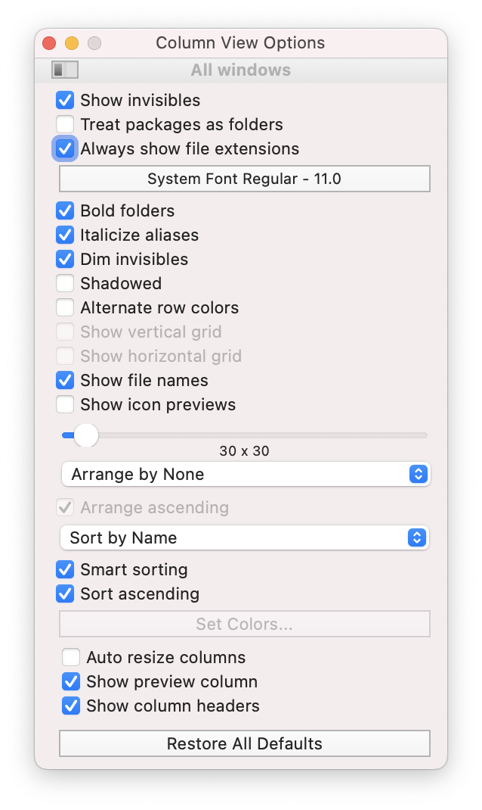

# Installing  git

1. Install git

2. Sign up for a GitHub account

# Using git

1. In your computer's **file browser** ensure that you can see:
  - **Invisible files and folders** (On the Mac these start with a period e.g. `.git`)

  - **File extensions** (This is the part of the filename at the *end* after a period. For example in the filename `test.doc`  the extension is `.doc`)

  

  
