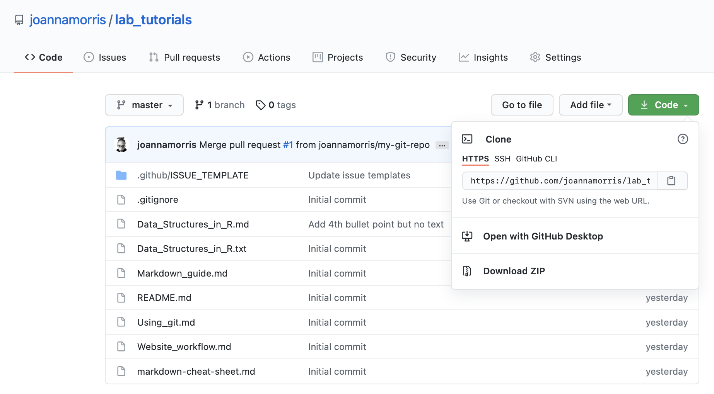

# Installing  git

1. Install git

2. Sign up for a GitHub account

# Make sure that you can see invisible files in the Finder

3. In your computer's **file browser** ensure that you can see:
  - **Invisible files and folders** (On the Mac these start with a period e.g. `.git`)

  - **File extensions** (This is the part of the filename at the *end* after a period. For example in the filename `test.doc`  the extension is `.doc`)

  

  - Many of the files that git needs to function are files that begin with a period which are **invisible files** on the Mac OS (operating system).

4. Cloning a repository from GitHub

  - A repository on GitHub exists as a **remote repository**.

  - To work on the files on your own computer, you can **clone** the repository which creates a local copy on your computer.  

  - You can then synchronize the files between the your computer and the remote repository on GitHub.

  - To clone a repository, first find the **URL** for the repository on GitHub

  

  - In the terminal, navigate to the **directory** on your computer to which you want to  copy the repository e.g `cd ~/my_git_repos`

  - Once in that directory,  type `git clone https: [your_repository]`.  For example `git clone https://github.com/joannamorris/lab_tutorials.git`

  - This creates a copy of the entire repository in your directory. Now you can edit the files without worrying about making a mistake messing up the files that are safely stored in the GitHub repo remotely in the cloud.

  - When you are ready to add your changes, you must upload your changed files to the remote GitHub repository.

5. Forking vs Cloning

  - Like a clone, a **fork** is a copy of a repository that you manage, and that let you make changes to a project without affecting the original repository.

   - When you fork a repository, you create a copy of the original repository but the repository remains on your GitHub account.

   - The changes made in the cloned repository (on your local computer) are **pushed** (or uploaded) to the forked repository.

   - Changes made to the forked repository can be merged with the original repository via a **pull request** which is a request to the original the repository owner to merge your changes with (or **pull** your changes into) the original repository.

   - Summary of the steps to add anything to the requisite github project:

    - ***Step 1***: The user **forks** a repository to their own GitHub account.

    - ***Step 2***: The user **clones** the repository to his or her local machine.

    - ***Step 3***: The user edits the files and then **commits** these edits to the local repository. A contributor can apply a single commit or multiple commits to the repository. But everything happens on his or her local system.

    - ***Step 4***: The user **pushes** the modifications to the upstream repository on his or her account (the fork).

    - ***Step 5***: The user sends a a request to the owner of the original repository to merge (pull) the changes into the main central repository.  This is a **pull request**.

  B. Fetch and Rebase

    - When you **fork** a repository,  it's good practice to regularly sync your fork with the upstream repository.

   - Usinng the terminal, The `remote` command shows which remote repositories are currently connected to your local repository. It also allows you to add new connections or remove existing ones.

   - Each connection to your local repository has a *name* and a *URL*. 

  B. How to create a branch

      1. In the terminal

  B. How to commit changes using Git

      1.

  C. How to open a pull request on GitHub.
    1. **Pull requests**  are the outstanding features or fixes that people are currently working on.

  D.
